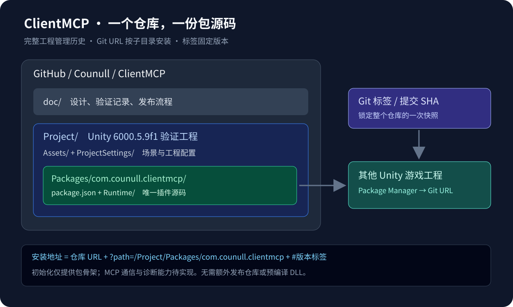
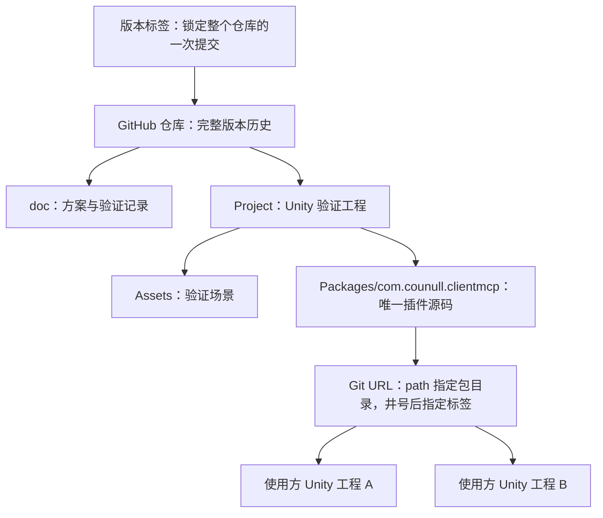

# 工程结构与 UPM 发布流程

## 当前选型

一个 GitHub 仓库维护完整工程历史：Unity 验证场景、项目配置、UPM 源码、设计文档一起提交。UPM 消费者只安装包目录；不需要另建发布仓库，也不需要复制源码到发布分支。

语言为 C#，开发工程使用 Unity 6000.5.9f1，插件以嵌入式 UPM 包位于 `Project/Packages/com.counull.clientmcp/`。独立 .NET 桥接程序、MCP SDK、网络协议、反射查询范围仍待设计，不在初始化阶段预选。





## Git 管理范围

提交 `Assets` 及其 `.meta`、`Packages/manifest.json`、`Packages/packages-lock.json`、嵌入包及其 `.meta`、`ProjectSettings` 和文档。忽略 Library、Temp、Logs、UserSettings、IDE 缓存和构建产物。

开发者克隆完整仓库并打开 `Project/`，直接编辑嵌入包。使用方通过 Git URL 安装后，不应在 `Library/PackageCache` 中维护修改；贡献代码应回到源码仓库。

“管理全部历史”表示所有被提交的源码、资源和文档均有历史，不表示保存缓存、每次按键或未提交内容。即使 UPM 只导入子目录，Git 获取仓库仍可能产生整个仓库的传输成本，因此不要把大型测试素材或构建包混进源码历史。

## Git URL 如何定位包

```text
https://github.com/Counull/ClientMCP.git?path=/Project/Packages/com.counull.clientmcp#v0.1.0
```

- `.git` 之前：完整源码仓库。
- `?path=`：相对仓库根目录的包位置，该目录必须包含 `package.json`。
- `#v0.1.0`：标签，锁定一个提交；也可以使用分支名或完整提交 SHA。
- 顺序必须为 `?path=...#revision`。

在使用方 Unity 中选择 **Window → Package Manager → Install package from git URL**，粘贴地址；也可在使用方 `Packages/manifest.json` 的 `dependencies` 中添加：

```json
{
  "com.counull.clientmcp": "https://github.com/Counull/ClientMCP.git?path=/Project/Packages/com.counull.clientmcp#v0.1.0"
}
```

上面的版本 URL 是发布示例，本次不会创建 `v0.1.0` 标签。初始化快照可使用 `#main`，但它不是稳定版本。

2026-09-30 已在独立 Unity 6000.5.9f1 消费工程实测 `#main` 安装地址：包来源为 `Git`，解析到初始化提交 `4333688`，包注册和编译检查通过，Unity 正常退出。这里的验证不包含 Player 构建或 MCP 功能。

UPM 的 Git 依赖必须写在使用方工程的 `manifest.json` 中，不能在本包的 `package.json` 里用 Git URL 声明另一个包依赖。使用方应安装 Git 并使其可从 PATH 找到。

## 后续发布步骤

1. 日常在 `main` 完成修改与验证；需要隔离开发时使用 `dev`。发布版本前更新 `package.json` 版本及 `CHANGELOG.md`。
2. 在 Unity 验证工程中检查编译和真实功能；发布前再用干净的消费工程验证 Git URL 安装。运行时能力需要额外验证 Player，Editor 成功不代表 IL2CPP 成功。
3. 审查 diff 和公开内容后创建中文 Conventional Commit；本个人项目不强制 PR 或分支保护，日常提交可直接推送。
4. 用户明确授权本次发布和推送后，为发布提交创建不可随意移动的标签。例如版本 `0.1.0` 对应 `v0.1.0`，预览版本可使用 `v0.1.0-preview.1`。
5. 推送对应分支和指定标签。GitHub Release 可选，用于发布说明；Git URL 安装本身只需要远端 Git 引用，不需要上传 DLL 或 `.unitypackage`。
6. 使用方把 URL 中的标签改为新版本，并提交更新后的 `manifest.json` 和 `packages-lock.json`。

以下命令仅说明将来的版本发布流程，不代表已经执行或获得创建版本标签的授权：

```bash
git tag -a v0.1.0 <发布提交SHA> -m "发布 ClientMCP 0.1.0"
git push origin <发布分支>
git push origin v0.1.0
```

`package.json` 的版本号不会自动创建标签，也不会让已安装的 Git 包自动升级。固定标签或 SHA 比浮动分支更便于复现。

## 参考

- [Unity：Git 依赖、子目录与 revision](https://docs.unity3d.com/6000.0/Documentation/Manual/upm-git.html)
- [Unity：Package 目录布局](https://docs.unity3d.com/6000.0/Documentation/Manual/cus-layout.html)
- [当前验证记录](status.md)
